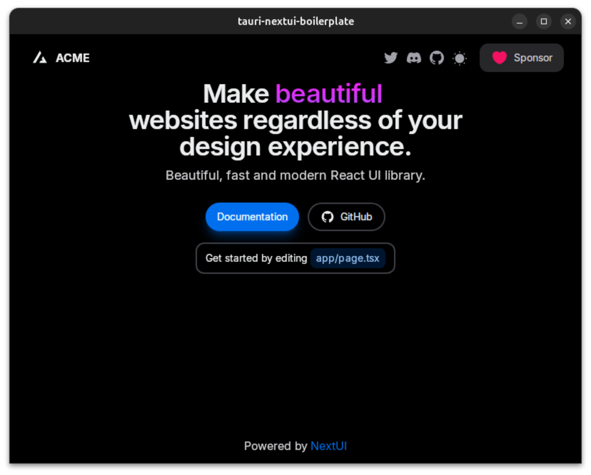

# Tauri NextUI Boilerplate

A simple and flexible boilerplate for building web applications with [Node.js/React/Other Framework], tailored to get you started quickly.



## Table of Contents

- [Installation](#installation)
- [Usage](#usage)
- [Folder Structure](#folder-structure)
- [Contributing](#contributing)
- [License](#license)

## Installation

Follow these steps to get your environment set up.

1. Clone this repository:
   ```bash
   git clone https://github.com/ixlammm/tauri-nextui-boilerplate project-name
   cd project-name
   ```

2. Install dependencies:
   ```bash
   pnpm install
   ```

3. Run the application:
   ```bash
   pnpm tauri dev
   ```

## Usage

You can use this boilerplate as a base for your app project. The structure and configuration are designed for simplicity, but feel free to extend and customize as needed.

## Folder Structure

This boilerplate follows a simple folder structure to keep your code organized.

```plaintext
/project-name
├── /components          # NextUI components
├── /src                 # NextJS source directory
│   ├── /app            
│   ├── /config         
│   ├── /public          
│   ├── ...          
├── .env.local           # Environment variables (create your own)
├── package.json         # Project metadata and dependencies
├── README.md            # This file
└── ...
```

## Contributing

Contributions are welcome! Please fork the repository and submit a pull request with your changes.

1. Fork the repo.
2. Create a new branch:
   ```bash
   git checkout -b feature-name
   ```

3. Make your changes and commit:
   ```bash
   git commit -am 'Add new feature'
   ```

4. Push to your branch:
   ```bash
   git push origin feature-name
   ```

5. Create a new Pull Request.

## License

This project is licensed under the MIT License - see the [LICENSE](LICENSE) file for details.
